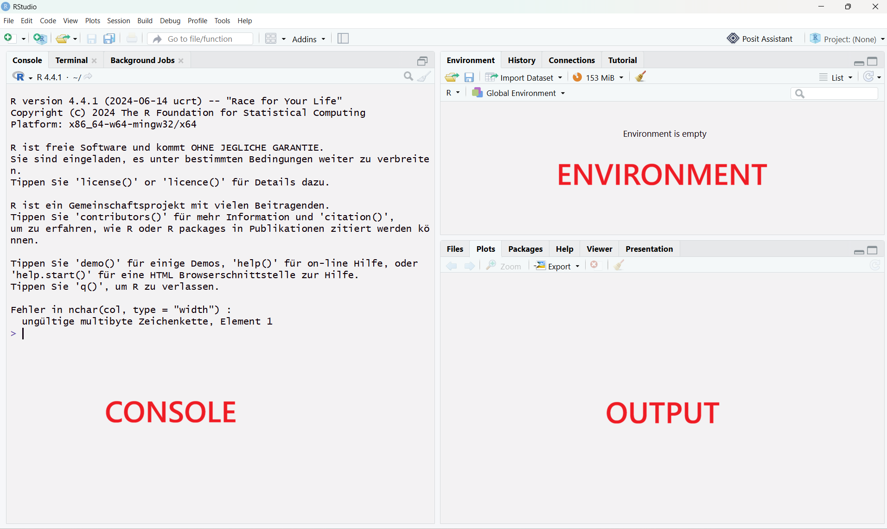
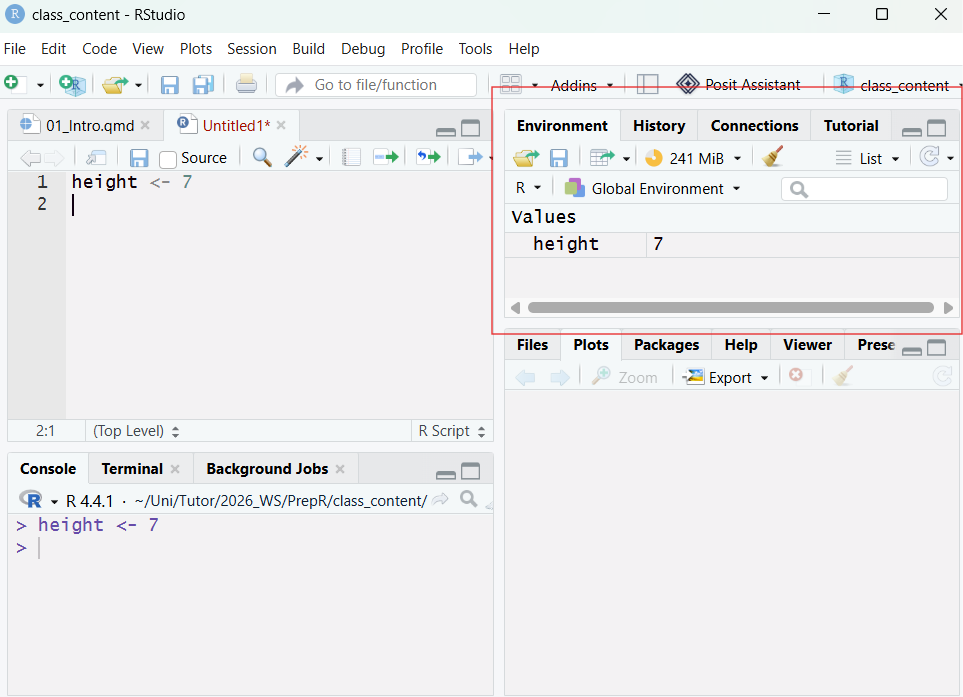
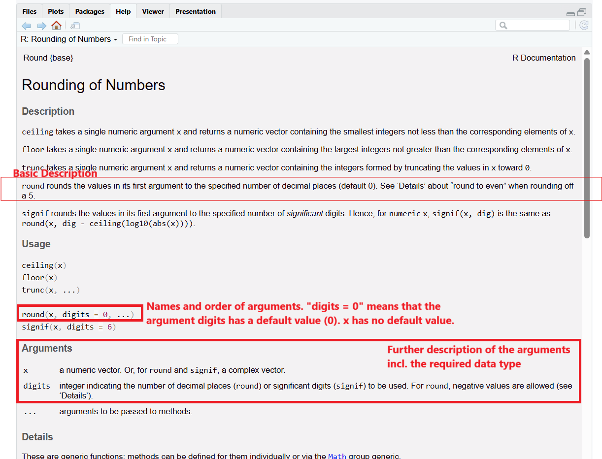

## Organization of this Course

Welcome! This course aims to teach the basics of R programming so you are prepared for the M.Sc. Forest and Ecosystem Sciences. Each day we are covering a different topic:

1.  Getting started with R
2.  Importing data, data frames, factors, data exploration
3.  Using libraries, filtering data, rearranging data
4.  Data visualization
5.  Summary, Mini Project

At the end of the class you should be able to read a dataset into R, perform summary statistics, extract relevant information from the data, and create a simple visual representation.

For every topic, you have a pdf explaining the day's topic (what you are reading right now), an R script presenting all the code from the script, and an exercise where you can put your new skills into practice!

## Motivation

Many of you may be familiar with other means of statistical analysis (Excel, Stata...). Why do we use R instead? Programming may be intimidating at first, but R has many benefits:

- It is **reproducible,** meaning if someone has your code they can repeat every step of your analysis easily
- It is **free** instead of requiring a subscription or purchase
- It can deal with large datasets (hundreds of thousands of rows), including geospatial, genome, and other specialized data
- It is **open-source** with a large library of user-created packages that can extend its functionality. This makes R really flexible - for example, all teaching material for this class (including this pdf) is created in R.

## R & RStudio

R is a **programming language** intended for statistical computing. We are using R in combination with **RStudio**, an integrated development environment (IDE). RStudio is a powerful tool that makes working with R much easier.

When opening RStudio, it by default has three panels (the **console**, the **environment**, and the **output** pane.

{fig-align="center"}

The environment shows any objects you have created (we will explain what this means later). The output window shows any plots you create, but also includes among other tabs a file explorer and a help window. The console is where your code is executed.

If you type the following code into the console and hit "enter", you can see the result in the console:

```{r}
1 + 1
```

If you close R, this code will be lost. It is therefore always adviseable to save your results in an **R Code Script** (file ending .R). By clicking on *File -\> New File -\> R Script* in the top left corner, you open up a new panel, the **Script Panel.** Type any code in here and save it (*File -\> Save*) and you can re-open it next time you open R!

::: callout-note
Always try giving your files clear names. Avoid spaces and special characters other than \_ and - (including Ä, Ö...) in your file names, even if your system allows these file names.
:::

## Working with a Script

To run code from your R script, you place your cursor in the line you want to run. You then either click the **Run Button** in the top right corner of the script pane or click **CTRL + ENTER.**

You can see that the code is automatically pasted into the console. Any output for your code is also visible in the console.

::: callout-tip
### Tip

If you highlight part of a line and hit **CTRL + ENTER**, R will only run that part of the line. You can also highlight multiple lines the same way to run many lines at once.
:::

Alongside your code you can write comments by starting your line with #. R ignores any lines starting with \# - they are purely for the person reading the code. You should always add comments to your code. Make sure that you can understand the code even if you are reading it a year from now!

## R as a Pocket Calculator

R can simply be used as a calculator for arithmetic expressions. Try running the following lines:

```{r}
# simple arithmetic expressions 

1 + 6 # addition
10 - 4 # subtraction
10 / 3 # division
7 * 3 # multiplication
2**3 # power
2^3 # alternative way of writing power
```

In addition to these, **integer division** and the **modulo** are often used in programming. Integer division rounds the result of division down to the nearest whole number. The modulo is the remainder of the integer division.

```{r echo=F}
10 %/% 3 # integer division
10 %% 3 # modulo
```

## Objects and Data Types

Often times you want to save values as an **object.** This assigns the value to a **variable** that can be used to access the value. These variables are saved in the **environment.** For example, consider that we have measured the height of a tree and want to save the result for processing in R.

```{r}
height <- 7 # variable assignment using <-. In this case "height" is the variable and 7 is the object
```

After running this code, the variable should appear in your environment (top right).



::: callout-note
Variable names always start with a letter and contain letters, numbers, and some special characters (height_tree, height.tree, height-tree, height123).
:::

Always give your variable meaningful names (such as body_type instead of a if a variable represents a body type). Note that R is **case sensitive,** meaning that `height` and `Height` are different variables.

```{r}
Height <- 10
```

You can easily overwrite a variable's object/value by reassigning. This happens without warning!

```{r}
height <- 15
```

You can also assign the result of an equation to a variable and use variables in equations.

```{r}
# calculate area of a rectangle
width <- 5
height <- 10

volume <- width * height
```

You can use `ls()` to list all objects currently in the environment.

```{r}
ls()
```

::: panel-tabset\
### Comprehension Question

What is the value of `a` at the end of this code?

`a <- 10`

`b <- 5`

`c <- a + b`

`a <- c / b`

### Answer

3
:::

The objects saved in variables can have different **data types**. You can use the `str()` function to access the data type of a variable.

```{r}
dbh <- 20
str(dbh)
```

There are many different data types in R, but these are the three most important ones:

| Name | Meaning | Example |
|----|----|----|
| numerical (num) | numbers (also often called "double" in other programming numbers) | `body_weight <- 15.3` |
| character (chr) | text (also often called "string" in other languages). To assign a character value, put quotation marks around the text you want to save! | `species <- "canis lupus"` |
| boolean/logical (logi) | can only take the values TRUE/FALSE | `adult <- TRUE` |

If you accidentally save your data as the wrong data type, it may cause issues when trying to combine objects with different data types:

```{r, error = TRUE}
a <- 10
b <- "20"

a + b # this causes an error because b is the data type character
```

::: callout-tip
### Note on Logical Objects

Logical/Boolean values only take on the values FALSE/TRUE (capitalization important). Internally, FALSE is saved as 0 and TRUE is saved as 1. This means that logical objects behave as 0/1 in calculations, for example:

```{r}
11 + TRUE

```
:::

## Functions

R provides many built-in functions (also sometimes called "commands"). We have already lerned about two functions: `ls()`, which lists all objects currently in the environment, and `str()`, which tells us the structure - including data type - of an object. In more technical terms, a function is a shortcut to a longer block of code. You can even write your own functions for code you want to reuse often (covered on the last day).

Base R contains hundreds of functions and you can include even more using packages (topic of lesson 6), so we will not provide a full overview of all functions, but just introduce the functionality and a few important examples.

The name of a function is always followed by two brackets, which may include the **arguments** given to a function. Even when a function does not take any arguments, it is important to add them:

```{r}
ls() # lists all objects in the environment

ls # without the brackets, the output provides information about the function. 
# This includes the code behind the function, so the output can be quite long.
# Don't worry, you don't need to understand all of this!
```

Arguments are additional instructions for the function. For example, let's take a look at the `sqrt()` function which calculates the square root of a number. This number is given as the argument `x`.

```{r}
sqrt(x = 9)
```

Some functions can take multiple arguments, for example the function `round()` which takes the arguments `x` and optionally the argument `digits`. You can leave out the names of the arguments if you write them in the right order, or you can write them in the "wrong" order as long as you provide the names.

```{r}
round(x = 6.7442) # without a specification of "digits", the function rounds to the default (0 digits).

round(x = 10.4203910, digits = 3)

round(3.213, digits = 1)

round(digits = 2, x = 0.9241)
```

To see a description of a function and its arguments, you can use the help functionality by calling ?function_name (without the brackets!).

```{r}
?round
```

This will open up the function's documentation in your bottom right panel in RStudio. For `round()`, the documentation for multiple functions with similar purposes is grouped together. The documentation is quite long, but you can learn about the function's arguments from it:



::: callout-important
When you encounter an unfamiliar function, want to know how to use a function, or you encounter an error using a function, first check the help using ?function_name.
:::

::: callout-important
## Advanced: Additional Data Types & Converting Between Data Types

R saves numbers by default as numeric, a data type that can save numbers with decimals with high precision. Even numbers without decimals are saved as such unless explicitly declared otherwise.

A second data type for numbers commonly used in programming is **integer** which only saves whole numbers. To save a number as an integer, append an L to the end of the number:

```{r}
my_integer <- 4L
str(my_integer)
```

However, it is almost always sufficient to use the default numeric data type even with whole numbers. Remember the difference for learning other programming languages or for the rare cases where it does matter!\
\
You can convert between data types using the `as.numeric()/as.character()/as.integer()` functions. For example:

```{r}
# saving body height as character (quotation marks)
body_height <- "101.29"
str(body_height)

# converting body height to numeric
body_height <- as.numeric(body_height) # important: reassign the variable with <-
str(body_height)
```
:::

# A Note on AI Use

AI tools like the university's ChatAI (<https://chat-ai.academiccloud.de/>), ChatGPT or Claude can be a useful tool in coding, but it cannot fully replace your own programming skills. You are always fully responsible for the content of your code, even if it is AI-generated, and it is therefore important to fully understand all AI-generated code you use. In this course, we ask you to please **not use AI to solve the exercises.** Even if you don't manage to solve all exercises with the time given, you will learn more in your own attempt then you will by copying a solution from AI! However, you can use AI for additional explanations of the class content or for explanations in your native language - but always be aware that AI may hallucinate!

If you want to use AI for programming throughout your studies, always remember that you should remain in the driving seat of your project - do not let the AI make all decisions. Ensure you understand your code and consider AI guidelines (e.g. <https://uol.de/psychologie/open-science/ai-code-writing-guidelines>).
