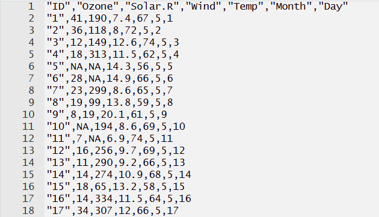
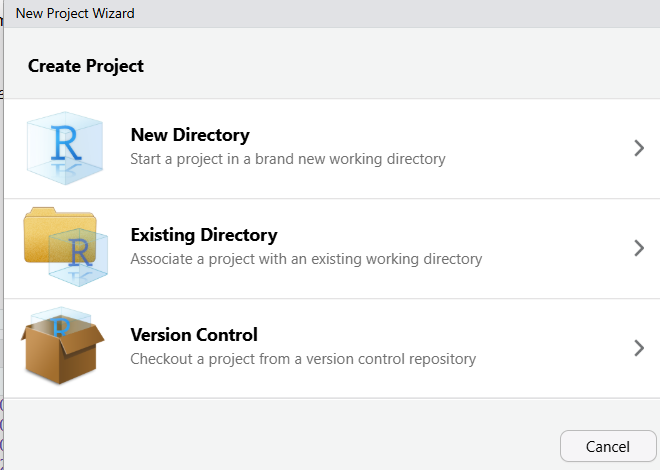
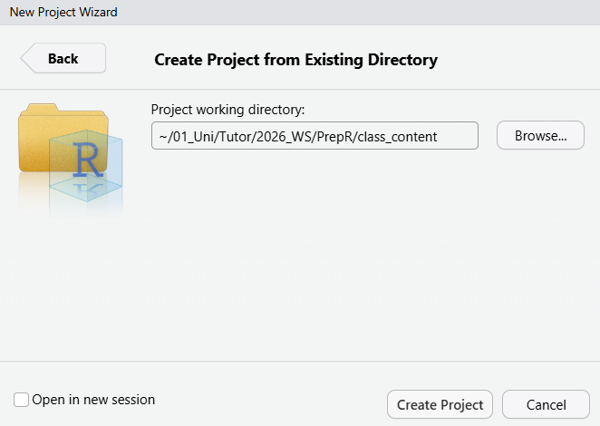
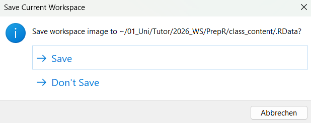

Welcome to topic 3! In this lesson, we will learn how to read in and export your own data.

## Reading in Data Frames

The most common format for tabular data (aka data frames) is `.csv` (comma-seperated values). In a `.csv` file, each row of data is one row of text, and the columns are seperated by commas. The first row is typically the header row containing the column names. This is what such a file might look like if opened in a text editor:



To read in a file, you use the `read.csv()` function. You also need to specify the **file path**. This will vary depending on where you saved your file and on your system. Let's say I want to read in the `airquality.csv` file in the "data" folder of the class. I enter the path to my file with forward slashes between the directories:

```{r}
airquality <- read.csv("C:/Users/quinn/OneDrive/Dokumente/01_Uni/Tutor/2026_WS/PrepR/class_content/data/airquality.csv")
```

To make this step easier, on most operating systems, you should be able to right-click on the file in your file manager/finder and find an option where you can copy the path to the file.

::: callout-tip
Make sure you are not reading in data from zipped folders (ending in .zip). Zipped folders are useful for file exchange, but R may not be able to read your data correctly. Always unzip the folder before reading data into R.
:::

Data can come in many different formats. Often, comma-seperated files are (ironically) not comma-seperated but may use a different seperator, like a semicolon or a tabstop. In **german files**, it is common for the decimal seperator to be a comma and the seperator between columns to be a semicolon. It is indeed so common R has its own function, `read.csv2()`, to deal with this case. Let's read in the file `airquality_2.csv` which is saved in the german format.

```{r}
# If we read in the file with read.csv, we can see that the file is not
# read in correctly
airquality <- read.csv("C:/Users/quinn/OneDrive/Dokumente/01_Uni/Tutor/2026_WS/PrepR/class_content/data/airquality_2.csv")
head(airquality)
```

```{r}
# If we use read.csv2 instead, the file is read in correctly
airquality <- read.csv2("C:/Users/quinn/OneDrive/Dokumente/01_Uni/Tutor/2026_WS/PrepR/class_content/data/airquality_2.csv")
head(airquality)
```

Both `read.csv()` and `read.csv2()` are technically versions of the function `read.table()`. That function can be used to read in data with a wide variety of decimal and column separators. Check `?read.table` for more information.

In this class, we only focus on csv files since they are the most commonly used, but R can read in a wide variety of data formats, especially when using packages (covered in the next lesson). Regardless of the type of data you read in, the next concepts will apply to almost all of them.

## Working Directories

If you need to add a lot of data - or might change the folder where your data is stored later on -, always adding the entire file path into `read.csv()` becomes tedious very fast. This is why it is a good idea to set a **working directory** at the beginning of your script. All file references are then done relative to the working directory. (It is an even better idea to use a project, which we will cover in the next step!)

To set a working directory, use the function `setwd()` and add path to the folder where you are storing your R files or data for the script you are working on. In my case, I want to set it to the folder that holds all material for the class, but you can also set yours to the data folder directly.

```{r}
setwd("C:/Users/quinn/OneDrive/Dokumente/01_Uni/Tutor/2026_WS/PrepR/class_content")
```

You can use `getwd()` to see the path of your current working directory.

```{r}
getwd()
```

After setting a working directory, you can reference your files relative to that working directory.

```{r}
# shorter file path as I only need to navigate into the data/ folder
airquality <- read.csv("data/airquality.csv")
```

## Projects

Working directories work well while the path to your data is not changing and while you are only working on it on one computer. In practice, you may work on different devices, move folders around, or share your work with others - in this case, they all need to change the `setwd()` in each of your scripts to match theirs. **R Projects** aim to solve this problem: if you open an R project, the working directory is automatically set to the folder of the project.

To create a new project, click on *File -\> New Project* in the top-left corner of the R window. There you have multiple options. I want to create a project for this class, which I already have a folder for, so I choose the *Existing Directory* option.

{fig-align="center" width="479"}

I then navigate to the location of the folder where I have saved all of the class content.

{fig-align="center" width="441"}

After you click on **Create Project**, there should be a new file in your folder ending in .Rproj. If you want to open a project, go on *File -\> Open Project...* and select the .Rproj file of your desired project. If you use `getwd()`, the working directory should now be the same as the location of your project file.

You can then enter paths relative to the working directory.

```{r}
airquality <- read.csv2("data/airquality_2.csv")
```

## Writing Data

If you want to export your results, you can save your data using `write.csv()`. You need to specify the object to be saved and the path + file name you want to save it under. Careful, R will overwrite your files without warning!

```{r}
# converting temperature from Fahrenheit to Celsius
airquality$Temp_C <- (airquality$Temp - 32) * 5/9

write.csv(airquality, file = "data/airquality_celsius.csv")
```

Like with reading data, `write.table()` offers more options on seperators used in the saved file.

::: callout-note
## Saving Your Workspace

When you close R, you may get a prompt like this (you can turn it off in the settings):

\


This will save all of the objects in your environment into a file that will be automatically loaded the next time you start R. While this seems very convenient, it is **not recommended**. It can easily lead to losing overview of your environment and how you have created the objects in it and if you lose the .Rdata file or accidentally overwrite it you may lose all your data!

Instead, save important objects with a clear name and read them in when you continue working on the project (or just run the code used to create the objects again). If you need to save your entire environment or many objects in it, check out `?save.image` and `?saveRDS`.
:::
