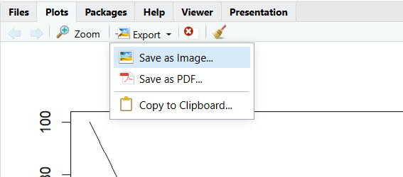

In this topic, we will cover how to create plots in R. We will first cover scatter plots and how to adjust visuals (axes labels, color-coding, adding a legend). Then, we take a look at other types of commonly used plots (line plots, box plots, histograms) and how to add additional lines or points to your plot. Finally, we cover how to export your figures in high quality.

## Plots in R

First, we have to load the data we want to use. In this case, we are using the iris dataset again.

```{r}
data(iris)
str(iris)
```

### Scatter Plots

The simplest function to create a plot in R is `plot()`. By default, it creates a scatterplot. It is suitable especially for plotting **two numeric variables** against each other. To do so, specify the `x` and `y` argument:

```{r}
plot(x = iris$Petal.Width, y = iris$Petal.Length)
```

Alternatively, you can write in the so-called **formula notation** which is written as `y ~ x` (can be read as "y as a function of x"). The code above would look like this in formula notation:

```{r}
plot(iris$Petal.Length ~ iris$Petal.Width)
```

### Additional Arguments

Of course, our plot does not look particularly nice right now. We may want to change the axes labels, for instance, to be more descriptive and include units. For this, we can use the `xlab` and `ylab` arguments. Using `main`, we can also set a title for the plot.

```{r}
plot(iris$Petal.Length ~ iris$Petal.Width,
     xlab = "Width [cm]", # x axis title
     ylab = "Length [cm]", # y axis title
     main = "Iris Petal Measurements") # plot title
```

As the iris dataset includes three different species, we might want to visualize these differences in our plot as well. For this, we can add the `col` argument to specify the color and the `pch` argument to specify the plotting character.

To vary the color/character based on a variable, that variable should ideally be **converted to a factor** (already the case for the iris dataset). We then need to provide a **vector of colors/plotting characters** that matches the number of factor levels. Finally, we provide the values we want to vary the color by in square brackets behind the vector.

```{r}
plot(iris$Petal.Length ~ iris$Petal.Width,
     ylab = "Length [cm]", xlab = "Width [cm]",
     col = c("red", "blue", "green")[iris$Species], # change color
     pch = c(0, 1, 2)[iris$Species] # change plotting character
     )
```

::: callout-tip
R recognizes many colors by name ("red", "blue", "green", ..., but also e.g. "salmon1", "rosybrown3") that cover a wide variety of shades. You can find an overview of these colors by running `colours()` or online (for example <https://derekogle.com/NCGraphing/img/colorbynames.png>).

The plotting character is given as a number between 0 and 25. You can run `?pch` for an overview of the plotting characters.
:::

There are many more options that you can find via `?plot` and `?par` (for additional graphical parameters related to, for example, font size and text colors).

### Adding Legends

There is now only one thing to finish our plot: add a legend. You add a function with the command `legend()` called *after* the `plot` command. Specify the location of the legend either as x/y coordinates or as a text ("bottomright", "topleft", "center", ...) and use the `legend` argument to specify the legend entries. For this, you need a vector of the entries. This could be `c(setosa, versicolor, virginica)` for our three iris species, but in this case, we use the `levels()` function to automatically extract the levels.

```{r}
# Creating the plot
plot(iris$Petal.Length ~ iris$Petal.Width,
     ylab = "Length [cm]", xlab = "Width [cm]",
     col = c("red", "blue", "green")[iris$Species], # change color
     pch = c(0, 1, 2)[iris$Species] # change plotting character
) # end of the plot() function

# Creating the legend
legend("bottomleft", # location 
       legend = levels(iris$Species), # legend text
       title = "species") # legend title
```

However, our legend still is not very informative. Unfortunately, R does not automatically recognize which color/plotting character is associated with which species. Therefore, we also need to specify this. The arguments are the same as the ones used in `plot()`: `pch` and `col`.

```{r}
# Creating the plot
plot(iris$Petal.Length ~ iris$Petal.Width,
     ylab = "Length [cm]", xlab = "Width [cm]",
     col = c("red", "blue", "green")[iris$Species], # change color
     pch = c(0, 1, 2)[iris$Species] # change plotting character
  ) # end of the plot() function

# Creating the legend
legend("bottomright", # location 
       legend = levels(iris$Species), # legend text
       col = c("red", "blue", "green"), # colors
       pch = c(0, 1, 2), # plotting characters
       title = "species") # legend title
```

### Line Plots

You can also use the `plot()` function to plot line plots by adding `type = "l"`. Let's load the Loblolly dataset which describes the growth of different trees over time:

```{r}
data(Loblolly)
head(Loblolly)
```

Let's plot the growth of seed 301 over time. For this, we first need to select seed 301:

```{r}
Loblolly_301 <- Loblolly[Loblolly$Seed == 301, ]
```

We can then create a plot:

```{r}
plot(Loblolly_301$age, Loblolly_301$height, type = "l")
```

Of course, we can also customize this plot as we could the scatterplot. The arguments `lwd` (line width) and `lty` (line type) are especially important here.

```{r}
plot(Loblolly_301$age,
     Loblolly_301$height,
     type = "l",
     ylab = "height [ft]",
     xlab = "age [yr]",
     main = "Loblolly Seed 301",
     lwd = 2, # make line bolder
     lty = "dotted" # plot dotted line
     )
```

### Boxplots

To create a boxplot, use the command `boxplot()`. Specify the x axis (categorical variable, e.g. species) and y axis (continuous variable, e.g. height) in the formula notation `y ~ x`.

```{r}
# Boxplot of Sepal Length of different Iris Species

boxplot(iris$Sepal.Length ~ iris$Species)
```

Again, we can adjust the visuals of our plot using the same arguments as in the `plot()` function.

```{r}
boxplot(iris$Sepal.Length ~ iris$Species,
        xlab = "Species",
        ylab = "Sepal Length [cm]",
        names = c("iris setosa",
                  "iris versicolor",
                  "iris virginica"), # change names beneath each box
        col = "#204C14", # fill color of boxplot
        border = "grey6" # border color
)
```

### Histograms

To plot a histogram, use the `hist()` function.

```{r}
hist(iris$Sepal.Length)
```

You can set the argument `freq` to FALSE to plot the probability density on the y axis instead of the counts.

```{r}
hist(iris$Sepal.Length, freq = F)
```

### Additional Plot Components

To add a straight line to a plot, use the function `abline()` *after* the `plot()` function. This adds a line on top of your plot. Depending on the arguments given to `abline()`, you can create a horizontal, vertical, or angled line.

```{r}
# Creating basic plot
plot(Loblolly$height ~ Loblolly$age,
     xlab = "age [years]", ylab = "height [feet]")

# add vertical line at x = 15
abline(v = 15, col = "red")

# add horizontal line at y = 30
abline(h = 30, col = "blue")

# add line with slope = 2, intercept = 0
abline(a = 0, b = 2, col = "green")
```

If you want to add additional points (e.g. a second dataset) to your plot, you can use the function `points()` *after* the creation of the plot. `points()` can take many of the same graphical arguments as `plot()`, so you can adjust color, size, plotting character, ... of your points in a similar way.

```{r}
plot(iris$Sepal.Width ~ iris$Sepal.Length,
     xlab = "Length [cm]", ylab = "Width [cm]",
     xlim = c(0, 8), ylim = c(0, 5)) # change y axis limits

# add petal width & length as red points
points(iris$Petal.Width ~ iris$Petal.Length,
       col = "red")
```

::: callout-tip
To add lines, you can use either the `lines()` function or use `type = "l"` in the points function.
:::

Finally, you can use `curve()` to draw any mathematical function into your figure. For example, let's say we tried to estimate the growth of the Loblolly pine using a logistic equation and now want to compare the equation to our data:

```{r}
plot(Loblolly$height ~ Loblolly$age,
     xlab = "age [yr]",
     ylab = "height [ft]")

curve(expr = 50/(1 + exp(0.35*(10 - x))), # function to be plotted
      from = 1, to = 25, # start and end point
      add = T) # add functio to plot
```

If we don't add `add = T`, we create a seperate plot for the function:

```{r}
# plot a simple quadratic equation
curve(expr = x**2, from = -10, to = 10)
```

## Exporting Plots

To export a plot, you can on the one hand use the "Export" button above the plot view:



You can then choose a file type and size (in pixels) for your export. However, sometimes you may want to automate saving your figure. Journals might also sometimes require certain figure sizes in cms, font sizes, or qualities that you can't adjust in the plot export window.

To export a png in code, use the `png()` function. Then create your plot - it will be automatically be exported to your specified file. Then call `dev.off()` to reset your graphics device and end the export.

```{r}
# open png graphics device
png(filename = "curve.png", # filename
    width = 15, height = 15, units = "cm", # set plot dimension in cm
    res = 100) # resolution (ppi) 

# create plot
curve(expr = x**2, from = -10, to = 10)

# turn off graphics device
dev.off()

```

You can export into other commonly used formats by using `pdf()`, `jpeg()`, `svg()`, or `tiff()`.
